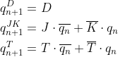

## Pre-Lab preparation

1. Write characteristic equations and complete truth tables for D, JK, T flip-flops where `q(n)` represents main output value before the clock edge and `q(n+1)` represents output value after the clock edge.

   
<!--
https://editor.codecogs.com/
\begin{align*}    
	q_{n+1}^D =&~D \\
	q_{n+1}^{JK} =&~J \cdot \overline{q_{n}} + \overline{K} \cdot q_{n} \\
	q_{n+1}^T =&~T \cdot \overline{q_{n}} + \overline{T} \cdot q_{n}\\
\end{align*}
-->

   **D-type FF**
   | **clk** | **d** | **q(n)** | **q(n+1)** | **Comments** |
   | :-: | :-: | :-: | :-: | :-- |
   |  | 0 | 0 | 0 | `q(n+1)` has the same level as `d` |
   |  | 0 | 1 | 0 | `q(n+1)` is not dependent on the previous level `q` |
   |  | 1 | 0 | 1 | `q(n+1)` has the same level as `d` |
   |  | 1 | 1 | 1 | `q(n+1)` is not dependent on the previous level `q` |

   **JK-type FF**
   | **clk** | **j** | **k** | **q(n)** | **q(n+1)** | **Comments** |
   | :-: | :-: | :-: | :-: | :-: | :-- |
   |  | 0 | 0 | 0 | 0 | Output did not change |
   |  | 0 | 0 | 1 | 1 | Output did not change |
   |  | 0 | 1 | 0 | 0 | Reset |
   |  | 0 | 1 | 1 | 0 | Reset |
   |  | 1 | 0 | 0 | 1 | Set |
   |  | 1 | 0 | 1 | 1 | Set |
   |  | 1 | 1 | 0 | 1 | Toggle |
   |  | 1 | 1 | 1 | 0 | Toggle |

   **T-type FF**
   | **clk** | **t** | **q(n)** | **q(n+1)** | **Comments** |
   | :-: | :-: | :-: | :-: | :-- |
   |  | 0 | 0 | 0 | Output did not change |
   |  | 0 | 1 | 1 | No change |
   |  | 1 | 0 | 1 | Toggle |
   |  | 1 | 1 | 0 | Toggle |