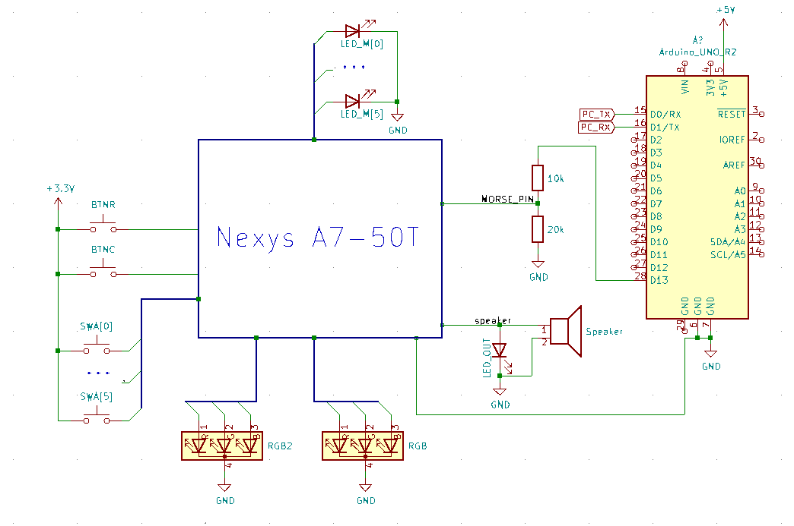

# Project - morse code decoder and transmiter

## Team members

 - Tomáš Husslik  - implementation, testbenches
 - Michal Hanus   - SW architecture, documentation

## Theoretical description and explanation

Custom numbering of characters:

| Dec |   Bin  | Char |  Code |
-------------------------------
|   1 | 000001 |   A  | .-    |
|   2 | 000010 |   B  | -...  |
|   3 | 000011 |   C  | -.-.  |
|   4 | 000100 |   D  | -..   |
|   5 | 000101 |   E  | .     |
|   6 | 000110 |   F  | ..-.  |
|   7 | 000111 |   G  | --.   |
|   8 | 001000 |   H  | ....  |
|   9 | 001001 |   I  | ..    |
|  10 | 001010 |   J  | .---  |
|  11 | 001011 |   K  | -.-   |
|  12 | 001100 |   L  | .-..  |
|  13 | 001101 |   M  | --    |
|  14 | 001110 |   N  | -.    |
|  15 | 001111 |   O  | ---   |
|  16 | 010000 |   P  | .--.  |
|  17 | 010001 |   Q  | --.-  |
|  18 | 010010 |   R  | .-.   |
|  19 | 010011 |   S  | ...   |
|  20 | 010100 |   T  | -     |
|  21 | 010101 |   U  | ..-   |
|  22 | 010110 |   V  | ...-  |
|  23 | 010111 |   W  | .--   |
|  24 | 011000 |   X  | -..-  |
|  25 | 011001 |   Y  | -.--  |
|  26 | 011010 |   Z  | --..  |
|  32 | 100000 |   0  | ----- |
|  33 | 100001 |   1  | .---- |
|  34 | 100010 |   2  | ..--- |
|  35 | 100011 |   3  | ...-- |
|  36 | 100100 |   4  | ....- |
|  37 | 100101 |   5  | ..... |
|  38 | 100110 |   6  | -.... |
|  39 | 100111 |   7  | --... |
|  40 | 101000 |   8  | ---.. |
|  41 | 101001 |   9  | ----  |

### Transmiter

Character represented by number (using table above) is converted to its correspondence morse code timing (one big decoder).
When triggered selected timing will "shift-out" to one ouput bit

### Reciver

When triggered input bit will "shift-in" to timming binary number (morsee code timing).

This "shifted-in" timing is converted to its correspondence morse code character (reversed decoder to trasmiter one).

Shift register clock has to respond to input morse timing.

## Hardware description of demo application

Insert descriptive text and schematic(s) of your implementation.

## Software description

Put flowchats/state diagrams of your algorithm(s) and direct links to source/testbench files in `src` and `sim` folders. 

### Component(s) simulation

Write descriptive text and simulation screenshots of your components.

## Instructions

Write an instruction manual for your application, including photos or a link to a video.

## References

1. https://archive.org/details/gov.archives.arc.36813