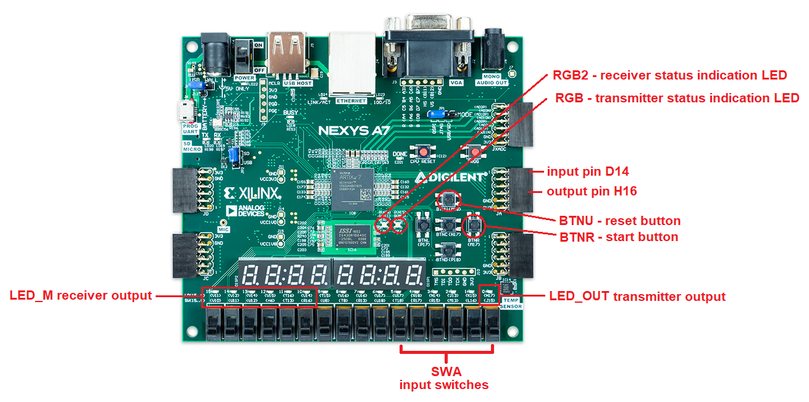

# Project - morse code decoder and transmiter

## Team members

 - Tomáš Husslik  - implementation, testbenches
 - Michal Hanus   - SW architecture, documentation

## Theoretical description and explanation

"Morse timing constant" is 200 ms - meaning that each pause between dot/dash lasts 200 ms, each dot lasts also 200 ms and dash lasts 600 ms

Custom numbering of characters:

| Dec |   Bin  | Char |  Code |
| --- | ------ | ---- | ----- |
|   1 | 000001 |   A  | .-    |
|   2 | 000010 |   B  | -...  |
|   3 | 000011 |   C  | -.-.  |
|   4 | 000100 |   D  | -..   |
|   5 | 000101 |   E  | .     |
|   6 | 000110 |   F  | ..-.  |
|   7 | 000111 |   G  | --.   |
|   8 | 001000 |   H  | ....  |
|   9 | 001001 |   I  | ..    |
|  10 | 001010 |   J  | .---  |
|  11 | 001011 |   K  | -.-   |
|  12 | 001100 |   L  | .-..  |
|  13 | 001101 |   M  | --    |
|  14 | 001110 |   N  | -.    |
|  15 | 001111 |   O  | ---   |
|  16 | 010000 |   P  | .--.  |
|  17 | 010001 |   Q  | --.-  |
|  18 | 010010 |   R  | .-.   |
|  19 | 010011 |   S  | ...   |
|  20 | 010100 |   T  | -     |
|  21 | 010101 |   U  | ..-   |
|  22 | 010110 |   V  | ...-  |
|  23 | 010111 |   W  | .--   |
|  24 | 011000 |   X  | -..-  |
|  25 | 011001 |   Y  | -.--  |
|  26 | 011010 |   Z  | --..  |
|  32 | 100000 |   0  | ----- |
|  33 | 100001 |   1  | .---- |
|  34 | 100010 |   2  | ..--- |
|  35 | 100011 |   3  | ...-- |
|  36 | 100100 |   4  | ....- |
|  37 | 100101 |   5  | ..... |
|  38 | 100110 |   6  | -.... |
|  39 | 100111 |   7  | --... |
|  40 | 101000 |   8  | ---.. |
|  41 | 101001 |   9  | ----  |

### Transmitter

Character represented by number (using table above) is converted to its correspondending morse code timing (one big decoder).
When triggered, selected timing will "shift-out" to one output bit.

### Receiver

When triggered, input bit will "shift-in" to timming binary number (morse code timing).

This "shifted-in" timing is converted to its correspondending morse code character (reversed decoder to transmitter one).

Shift register clock has to respond to input morse timing.

## Hardware description of demo application

For the purpose of testing the decoder, Arduino is used to generate morse code signal

## Software description

The device is implemented as a single block. Transmission and reception of signals are performed independently on each other. The device can work simultaneously as a transmitter and a receiver. 

### Entity description 
#### clock_enable
Divides base clock provided by the board - 100 MHz -> 5 Hz
Simulation - here, the base clock is divided by 10 for clarity reason

#### bin2morse

Converts character represented by 6bit binary number (see table above for conversion) to sequence of characters which represent morse code timing. 22bit vector is used for all characters - if the timing is shorter than 22bits, the vector is appended by zeros to fill all 22 bits. 

Simulation:

#### morseout

Iterates over the 22bit timing vector and generates output signal. Starts encoding when a button is pressed. Stops after encoutering three zeros in a row. 

Simulation:

#### morse2bin

Inverse to bin2morse. Converts morse code timing in the form of 22bit vector to 6bit binary number which represents decoded character. 

Simulation:

#### morsein

Decodes incoming sequence on the input pin and converts it to 22bit binary vector. Is started automatically by the input signal. 

Simulation:

#### top

Envelope for all used entities. Provides connections between internal components and input/output with hardware. 

Simulation:

## Instructions

### Transmitter
1. Convert character to a number according to the conversion table
2. Set the number in its binary representation to the six switches. Rightmost switch is LSB.
3. Press BTNR (right middle) button to start transmission.
4. Transmitted sequence now appears on the output pin H16 and the rightmost LED above the switches. 

### Receiver

1. Bring input signal to input pin D14
2. Device now starts decoding, which is indicated by left state LED (yellow color)
3. When the LED turns off, decoding is finished, read the 6 leftmost LEDs (6th from the left is LSB)
4. Convert this binary number represented by LEDs back to the character using the table. 

## Demo

https://raw.githubusercontent.com/husslt/digital-electronics-1/main/labs/09-project/images/demo.mp4

## References

1. https://archive.org/details/gov.archives.arc.36813
2. https://digilent.com/reference/programmable-logic/nexys-a7/reference-manual
